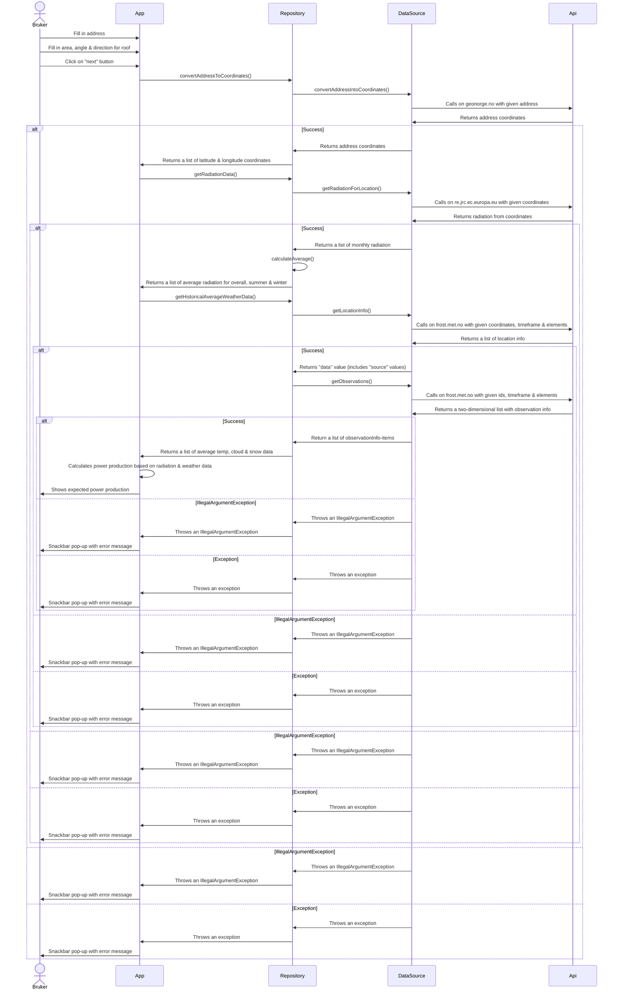
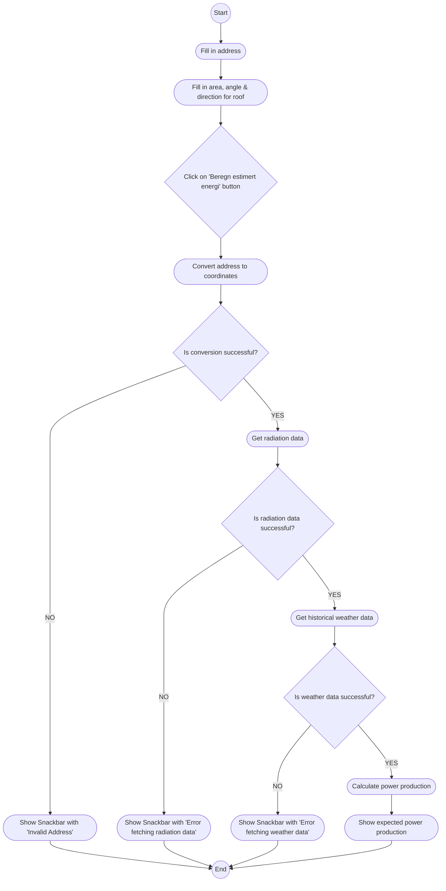
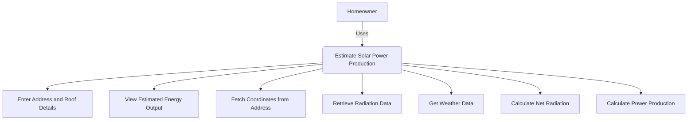

■ Beskrivelse og diagrammer, vi anbefaler å generere dem med
Mermaid som vist på forelesning. Se kravene til modellering
lenger ned i dette dokumentet. Ha med hvorfor diagrammet er
valgt og hva dere ønsker å med det.


# Sekvensdiagram


# Aktivitetsdiagram


# Klassediagram
Klassediagrammet er her for at utviklere skal ha oversikt over hvilke klasser vi har i appen og sammenhengene mellom dem.

```mermaid
classDiagram
direction LR
%% Class definitions
    %% UI Layer
    class MainActivity {
        +onCreate(savedInstanceState: Bundle)
    }
    class DataScreen {
        +DataScreen(navController: NavController, viewModel: DataViewModel, modifier: Modifier)
    }
    class DataViewModel {
        -_weatherRepository: WeatherRepository
        -_radiationRepository: RadiationRepository
        -_dataUIState: MutableStateFlow<DataUIState>
        -solarPowerJob: Job?
        +dataUIState: StateFlow<DataUIState>
        +setPosition(latitude: Double, longitude: Double)
        +onButtonClick()
        +calculateSolarPower()
        -getOneYearTimeFrame(): String
        -setSnackBarMessage(msg: String)
        +clearSnackBarMessage()
        +updateArea(value: String)
        +updateDegrees(value: String)
        +updateDirection(value: Name)
        +zoomIn()
        +zoomOut()
    }
    class DataUIState {
        +expectedPowerProduction: Double
        +incomingSolarEnergy: Double
        +temperature: Double
        +roofArea: String
        +roofDegrees: String
        +roofDirection: Name
        +snackBarMessage: String?
        +latitude: Double
        +longitude: Double
        +zoom: Double
    }

    class LocationScreen {
            +LocationScreen(navController: NavController, viewModel: LocationScreenViewModel)
        }
    class LocationScreenViewModel {
        -_coordinateRepository: CoordinateRepository
        -_locationUIState: MutableStateFlow<LocationUIState>
        +locationUIState: LocationUIState
        +onAddressChange(newString: String)
        +onAddressCommitted()
        +onCoordinateChange(coordinate: LatLng, onTap: Boolean)
        +zoomIn()
        +zoomOut()
        -setCameraPosition(target: LatLng?, zoom: Double?)
        -isValidAddress(address: String): Boolean
        -setSnackBarMessage(msg: String?)
        +clearSnackBarMessage()
    }
    class LocationUIState {
            +address: String
            +coordinate: LatLng?
            +cameraPosition: CameraPosition
            +hasLocation: Boolean
            +snackBarMessage: String?
        }

    %% Data Layer - Repositories
    class CoordinateRepository {
        -datasource: GeoNorgeDatasource
        +convertAddressToCoordinates(address: String,): List<Double>
    }
    class RadiationRepository {
        -datasource: RadiationDatasource
        +getRadiationData(latitude: Double, longitude: Double): List<Double>
        +getRadiationDataForMonth(latitude: Double, longitude: Double, month: Int): Double
        -calculateAverage(items: List<MonthlyRadiation>): List<Double>
    }
    class WeatherRepository {
        -datasource: FrostDatasource
        +getCurrentWeatherData(longitude: Double, latitude: Double): List<Double>
        +getHistoricalAverageWeatherData(longitude: Double, latitude: Double, timeframe: String): List<Double>
    }

    %% Data Layer - Datasources
    class GeoNorgeDatasource {
        -ktorHttpClient: HttpClient
        +convertAddressIntoCoordinates(address: String): AddressInfo
    }
    class RadiationDatasource {
        -ktorHttpClient: HttpClient
        +getRadiationForLocation(latitude: Double, longitude: Double): List<MonthlyRadiation>
    }
    class FrostDatasource {
        -clientId: String
        -clientPassword: String
        -ktorHttpClient: HttpClient
        +getLocationInfo(longitude: Double, latitude: Double, timeframe: String): List<LocationInfo>
        +getObservations(ids: List<String>, timeframe: String): List<ObservationInfo>
    }

    %% Model Layer - Data Classes
    class AddressInfo {
        +lat: Double
        +lon: Double
    }
    class AddressOutput {
        +addresses: List<AddressMeta>
    }
    class AddressMeta {
        +representation: AddressInfo
    }
    class MonthlyRadiation {
        +year: Int
        +month: Int
        +radiation: Double
    }
    class RadiationOutputs {
        +outputs: Outputs
    }
    class Outputs {
        +monthly: List<MonthlyRadiation>
    }
    class LocationInfo {
        +id: String
    }
    class MetaDataLocation {
        +data: List<LocationInfo>
    }
    class ObservationInfo {
        +elementId: String
        +value: Double
    }
    class OutputObservation {
        +data: List<ObservationMetaData>
    }
    class ObservationMetaData {
        +observations: List<ObservationInfo>
    }

    %% Utility Functions (as standalone)
    class Calculations {
        +calculatePowerProduction(radiation: Double, roofArea: Double, roofDegrees: Double, roofDirection: String): Double
        +calculateNetRadiation(radiation: Double, temperature: Double, cloudiness: Double, snowLevel: Double): Double
    }

    %% Enums and Interfaces
    class Direction {
        +NORTH
        +SOUTH
        +EAST
        +WEST
        +fetchName(): String
    }
    class Name {
        <<interface>>
        +fetchName(): String
    }

   %% Class Relations
    %% UI Layer
    MainActivity "1" --* "1" DataScreen : Launches
    MainActivity "1" --* "1" LocationScreen : Launches

    DataScreen "1" --* "1" DataViewModel : Uses
    DataViewModel "1" --* "1" DataUIState : Manages
    DataViewModel "1" --* "1" RadiationRepository : Depends on
    DataViewModel "1" --* "1" WeatherRepository : Depends on
    DataViewModel "1" --* "1" Calculations : Calls
    DataUIState "1" --* "1" Name : Holds

    LocationScreen "1" --* "1" LocationScreenViewModel : Uses
    LocationScreenViewModel "1" --* "1" LocationUIState : Manages
    LocationScreenViewModel "1" --* "1" CoordinateRepository: Depends on

    %% Data Layer - Repositories and Datasources
    CoordinateRepository "1" --* "1" GeoNorgeDatasource : Uses
    RadiationRepository "1" --* "1" RadiationDatasource : Uses
    WeatherRepository "1" --* "1" FrostDatasource : Uses

    %% Data Layer - Model Classes (GeoNorge)
    GeoNorgeDatasource "1" --* "1" AddressInfo : Returns
    AddressOutput "1" --* "*" AddressMeta : Contains
    AddressMeta "1" --* "1" AddressInfo : Contains

    %% Data Layer - Model Classes (PVGIS)
    RadiationDatasource "1" --* "*" MonthlyRadiation : Returns
    RadiationOutputs "1" --* "1" Outputs : Contains
    Outputs "1" --* "*" MonthlyRadiation : Contains

    %% Data Layer - Model Classes (Frost)
    FrostDatasource "1" --* "*" LocationInfo : Returns (location)
    FrostDatasource "1" --* "*" ObservationInfo : Returns (observations)
    MetaDataLocation "1" --* "*" LocationInfo : Contains
    OutputObservation "1" --* "*" ObservationMetaData : Contains
    ObservationMetaData "1" --* "*" ObservationInfo : Contains

    %% Enums and Interfaces
    Direction "1" --* "1" Name : Implements

    %% Utility Functions (Standalone)
    %% Merk: Calculations er ikke en klasse, men en plassholder for funksjoner; ingen kardinalitet gjelder direkte
    %% Inkludert for fullstendighetens skyld, men vanligvis ikke knyttet til kardinalitet i dette formatet

```

# Use case-diagram
Use case-diagram hjelper utviklere med å forstå kravene og gir en visuell oversikt over systemets funksjonalitet og hvordan brukere interagerer med det.

# Use case-beskrivelse 
Use case-beskrivelse hjelper utviklere med å forstå systemets funksjonelle krav og gir en detaljert beskrivelse av hvordan brukere interagerer med systemet.

Bruksområde: Estimering av solenergiproduksjon for en boligeiendom

Navn: Anslå solenergiproduksjon
actor: Huseier (bruker)
Mål: Å beregne forventet månedlig solenergiproduksjon (i kWh) for en gitt eiendom basert på dens beliggenhet, takegenskaper og miljøforhold.

Forutsetninger (preconditions):
   •	Brukeren har en enhet med SolarSaver-appen installert (Android-basert, gitt koden).
   •	Appen har internettilgang for å hente data fra eksterne APIer (GeoNorge, PVGIS, Frost).
   •	Brukeren kjenner sin adresse og grunnleggende takdetaljer (areal, vinkel, retning).

Hovedscenario for suksess:

1.	Start appen:
   •	Brukeren starter SolarSaver-appen på sin Android-enhet.
   •	Appen viser HomeScreen, med inndatafelt og et rent grensesnitt stil med SolarSaverTheme.

2.	Skriv inn adresse:
   •	Brukeren legger inn adressen sin (f.eks. "Storgata 1") i OutlinedTextField merket "Adresse".
   •	Appen godtar inngangen som en streng (f.eks. "Storgata 1"), og deler den opp i gatenavn og nummer for koordinatoppslag.

3.	Spesifiser takdetaljer:
   •	Brukeren legger inn takområdet (f.eks. "50" m²) i "Areal"-feltet, som kun godtar sifre på grunn av KeyboardType.Number.
   •	Brukeren legger inn takvinkelen (f.eks. "30" grader) i "Grader"-feltet, også begrenset til tall.
   •	Brukeren velger takretningen (f.eks. "Sør") fra DropDownMenu, og velger blant alternativer som "Nord", "Øst", "Sør" eller "Vest" (definert i Direction.kt).

4.	Start beregning:
   •	Brukeren trykker på knappen "Beregn estimert energi".
   •	HomeScreen kaller HomeViewModel.onButtonClick, og sender adressen, takområdet, takgrader og retning.

5.	Hent koordinater:
   •	HomeViewModel deler adressen (f.eks. "Storgata" og "1") og bruker CoordinateRepository.convertAddressToCoordinates for å spørre i GeoNorge API.
   •	API-en returnerer breddegrad og lengdegrad (f.eks. [59.9139, 10.7522] for Oslo), håndtert av GeoNorgeDatasource.

6.	Hent data om solstråling:
   •	Ved å bruke koordinatene henter RadiationRepository.getRadiationData historiske solstrålingsgjennomsnitt fra PVGIS (via RadiationDatasource).
   •	Svaret inkluderer generelle, sommer- og vintergjennomsnitt (f.eks. [150,0, 200,0, 100,0] kWh/m²/måned), selv om bare det totale gjennomsnittet brukes for øyeblikket.

7.	Samle værdata:
   •	WeatherRepository.getHistoricalAverageWeatherData spør Frost API for klimadata over det siste året (f.eks. "2024-03-17/2025-03-17").
   •	Den returnerer gjennomsnitt for temperatur (f.eks. 5,0 °C), overskyet (f.eks. 4,0/8) og snødekning (f.eks. 1,0/4), hentet fra FrostDatasource.

8.	Beregn netto stråling:
   •	Appen kaller calculateNetRadiation med strålingen (f.eks. 150,0 kWh/m²), temperatur, overskyet og snønivå.
        Justeringer brukes:
       •  Temperatur: 1,0 (innen -10°C til 25°C)
       •  Skyet: 1 - (4/8 * 0,05) = 0,975
       •  Snø: 1 - (1/4 * 0,25) = 0,9375
       •  Netto stråling = 150,0 * 1,0 * 0,975 * 0,9375 ≈ 137,11 kWh/m².

9.	Estimer kraftproduksjon:
   •	calculatePowerProduction tar netto stråling (137,11 kWh/m²), takareal (50 m²), vinkel (30°) og retning ("Sør").
   •	Justeringer:
        •  Retning: 1,0 (Sør er optimal)
        •  Vinkel: 1,0 (30° er i området 15°-40°)
        •  Effekt = (137,11 * 50 * 1,0 * 1,0) * 0,2175 ≈ 1490,74 kWh/mnd.

10.	Vis resultater:
   •	HomeUIState oppdaterer med innkommende solenergi (137 kWh/m², avrundet) og forventet PowerProduction (1491 kWh, avrundet).
   •	Resultatkortet på hjemmeskjermen viser:
            "Estimert netto innkommende solstråling: 137 kWh/m²"
            "Estimert månedlig strømproduksjon: 1491 kWh."

Postbetingelser (Postconditions):
   •	Brukeren ser estimert solenergi og kraftproduksjon for eiendommen sin.
   •	Resultatene lagres i HomeViewModels tilstand, tilgjengelig for videre bruk eller visning.

Unntak:
   •	Ugyldig inndata: Hvis adressen er feilformet eller takdata mangler/ugyldige, kan appen krasje eller returnere nuller (f.eks. UnknownHostException setter som standard koordinater til [0.0, 0.0]).
   •	API-feil: Hvis GeoNorge, PVGIS eller Frost APIer er utilgjengelige, bruker appen reserveverdier (f.eks. 0,0), noe som fører til nullstilte resultater.
   •	Ikke-norske tegn: Adressefeltet håndterer ikke "Æ", "Ø" eller "Å" riktig (bemerket feil i HomeScreen.kt).

Merknader:
   •	Denne brukssaken gjenspeiler appens minimum viable product (MVP) i henhold til koden, og oppfyller de obligatoriske funksjonskravene: adresseoppslag, frostklimadata, strålingsberegning og effektestimering.
   •	Valgfrie funksjoner (f.eks. kartvisning, kostnadsbesparelser, Enova-støtte) er ikke implementert ennå, men kan forlenge denne brukstilfellet.
```
