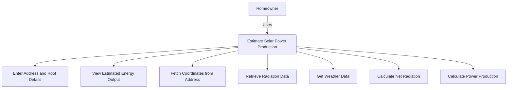
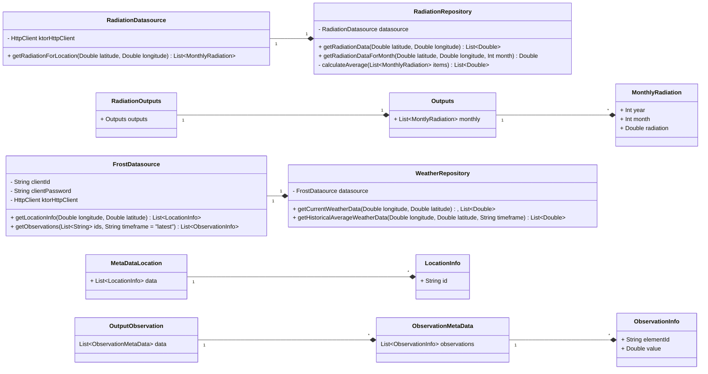

■ Beskrivelse og diagrammer, vi anbefaler å generere dem med
Mermaid som vist på forelesning. Se kravene til modellering
lenger ned i dette dokumentet. Ha med hvorfor diagrammet er
valgt og hva dere ønsker å med det.

# Use Case Diagram
Use Case helpe developers to see the overview of the main functionality of the app.

# Klassediagram
Klassediagrammet er her for at utviklere skal ha oversikt over hvilke klasser vi har i appen og sammenhengene mellom dem.


# sequenceDiagram
 ``` mermaid
   sequenceDiagram
    actor User
    participant UI as HomeScreen
    participant VM as HomeViewModel
    participant CR as CoordinateRepository
    participant RR as RadiationRepository
    participant WR as WeatherRepository
    participant Calc as Calculations
    

    User->>UI: Enter address, roof details
    User->>UI: Press "Beregn estimert energi"
    UI->>VM: onButtonClick(address, area, degrees, direction)
    VM->>CR: convertAddressToCoordinates(address)
    CR-->>VM: [latitude, longitude]
    VM->>RR: getRadiationData(latitude, longitude)
    RR-->>VM: [overallAvgRadiation, summerAvg, winterAvg]
    VM->>WR: getHistoricalAverageWeatherData(latitude, longitude, timeframe)
    WR-->>VM: [temperature, cloudiness, snowLevel]
    VM->>Calc: calculateNetRadiation(radiation, temp, cloud, snow)
    Calc-->>VM: netRadiation
    VM->>Calc: calculatePowerProduction(netRadiation, area, degrees, direction)
    Calc-->>VM: expectedPower
    VM->>UI: Update HomeUIState(netRadiation, expectedPower)
    UI-->>User: Display results (e.g., 137 kWh/m², 1491 kWh)
```
