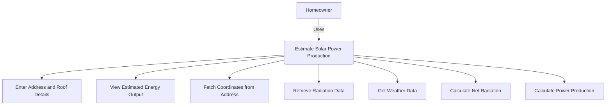

#SolarSaverProject-akilas'

# Use case Diagram

```mermaid
graph TD
    A[Homeowner] -->|Uses| B(Estimate Solar Power Production)
    B --> C[Enter Address and Roof Details]
    B --> D[View Estimated Energy Output]
    B --> E[Fetch Coordinates from Address]
    B --> F[Retrieve Radiation Data]
    B --> G[Get Weather Data]
    B --> H[Calculate Net Radiation]
    B --> I[Calculate Power Production]
```
